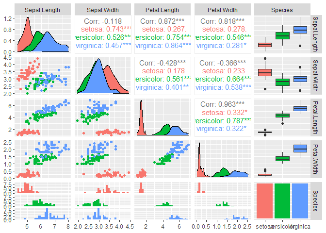

Example Post From RStudio
================

## Cool Research Project

Description of how awesome it is. Maybe some code that does something to
demonstrate.

``` r
knitr::kable(summary(iris))
```

|     | Sepal.Length  | Sepal.Width   | Petal.Length  | Petal.Width   | Species       |
|:----|:--------------|:--------------|:--------------|:--------------|:--------------|
|     | Min. :4.300   | Min. :2.000   | Min. :1.000   | Min. :0.100   | setosa :50    |
|     | 1st Qu.:5.100 | 1st Qu.:2.800 | 1st Qu.:1.600 | 1st Qu.:0.300 | versicolor:50 |
|     | Median :5.800 | Median :3.000 | Median :4.350 | Median :1.300 | virginica :50 |
|     | Mean :5.843   | Mean :3.057   | Mean :3.758   | Mean :1.199   | NA            |
|     | 3rd Qu.:6.400 | 3rd Qu.:3.300 | 3rd Qu.:5.100 | 3rd Qu.:1.800 | NA            |
|     | Max. :7.900   | Max. :4.400   | Max. :6.900   | Max. :2.500   | NA            |

## Including Plots

You can also embed plots, for example:

    ##  plot: [1,1] [>--------------------------]  4% est: 0s  plot: [1,2] [=>-------------------------]  8% est: 1s  plot: [1,3] [==>------------------------] 12% est: 1s  plot: [1,4] [===>-----------------------] 16% est: 1s  plot: [1,5] [====>----------------------] 20% est: 1s  plot: [2,1] [=====>---------------------] 24% est: 1s  plot: [2,2] [=======>-------------------] 28% est: 1s  plot: [2,3] [========>------------------] 32% est: 1s  plot: [2,4] [=========>-----------------] 36% est: 1s  plot: [2,5] [==========>----------------] 40% est: 1s  plot: [3,1] [===========>---------------] 44% est: 1s  plot: [3,2] [============>--------------] 48% est: 1s  plot: [3,3] [=============>-------------] 52% est: 1s  plot: [3,4] [==============>------------] 56% est: 1s  plot: [3,5] [===============>-----------] 60% est: 1s  plot: [4,1] [================>----------] 64% est: 1s  plot: [4,2] [=================>---------] 68% est: 0s  plot: [4,3] [==================>--------] 72% est: 0s  plot: [4,4] [====================>------] 76% est: 0s  plot: [4,5] [=====================>-----] 80% est: 0s  plot: [5,1] [======================>----] 84% est: 0s `stat_bin()` using `bins = 30`. Pick better value with
    ## `binwidth`.
    ##  plot: [5,2] [=======================>---] 88% est: 0s `stat_bin()` using `bins = 30`. Pick better value with
    ## `binwidth`.
    ##  plot: [5,3] [========================>--] 92% est: 0s `stat_bin()` using `bins = 30`. Pick better value with
    ## `binwidth`.
    ##  plot: [5,4] [=========================>-] 96% est: 0s `stat_bin()` using `bins = 30`. Pick better value with
    ## `binwidth`.
    ##  plot: [5,5] [===========================]100% est: 0s                                                        



Note that the `echo = FALSE` parameter was added to the code chunk to
prevent printing of the R code that generated the plot.
