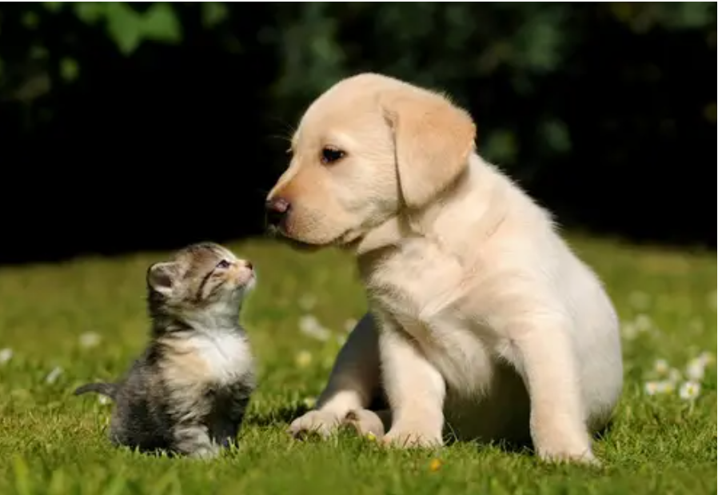
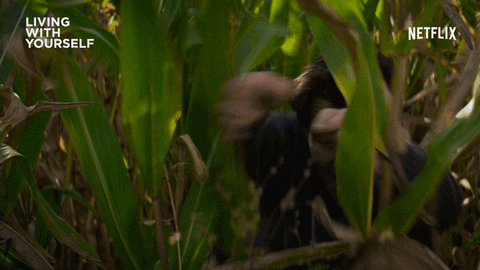

Hey all! This is a blog. How fun.

Things I'll blog about:
 - How fun it is to blog
 - How fun it is to give a presentation about setting up a blog
 - More things like that

You can also include **bold font** or [links](https://www.google.com). 

## Headers too!

Images work as well but things like size can be a little tough to control without some reading:

### You can include HTML too

